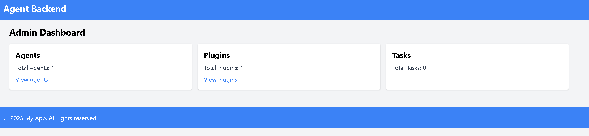
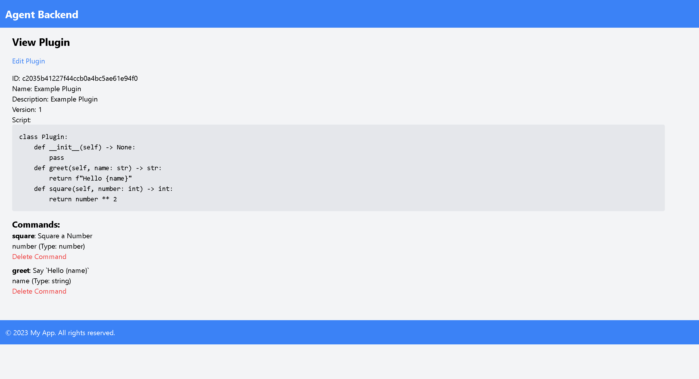

# agent_backend
Proof of Concept for the agent backend.

90% of programing provided by ChatGPT; 10% + 190% Review by Sniper7Kills

This code base is simply a proof-of-concept and should not be used in production.

Admin Interface: `http://127.0.0.1:5000/admin`

## Screen Shots

### Dashboard

### Agent Listing

### Agent Details
Note: the "greet" task did not run yet.

### Create Task

### Assign a Plugin

### Plugin Listing

### Create Plugin

### Plugin Details

### Edit Plugin
